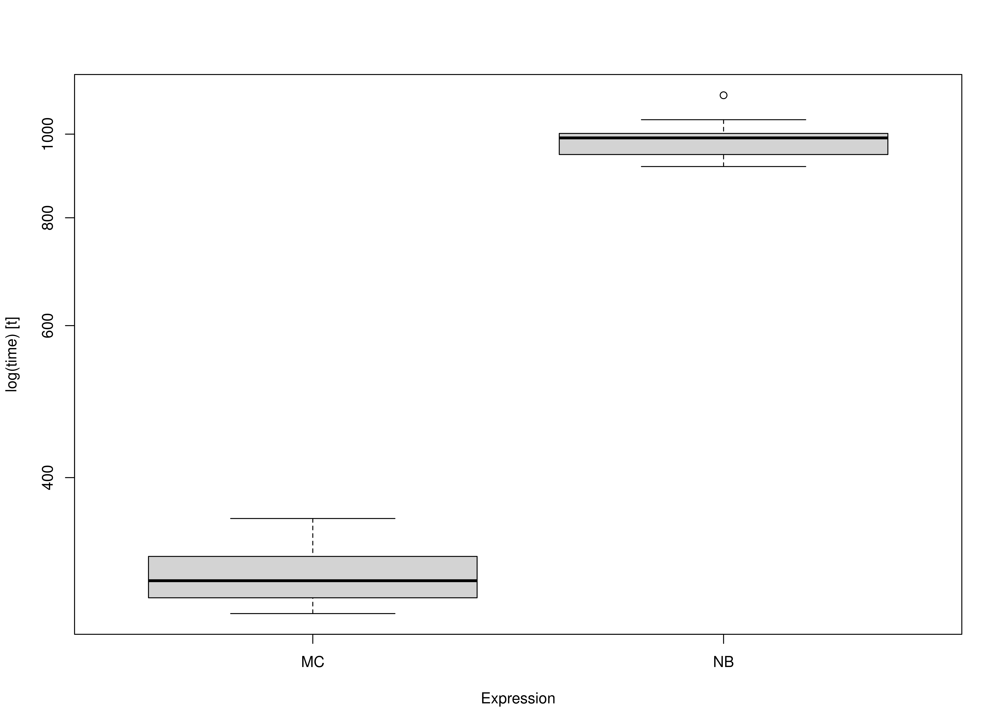

We compare the Monte Carlo (MC) method with nonparametric bootstrapping (NB)
for standardized regression coefficients.
In this example,
we use the data set and the model used in
[betaMC: Example Using the BetaMC Function](example-beta-mc.html).


```r
library(betaMC)
library(boot)
library(microbenchmark)
```

The `BetaMC()` function is used to generate MC confidence intervals.
The `BetaNB()` function is used to generate NB confidence intervals.


```r
BetaNB <- function(data,
                   B) {
  beta <- function(rhocap) {
    k <- dim(rhocap)[1]
    return(as.vector(
      solve(rhocap[2:k, 2:k, drop = FALSE], rhocap[2:k, 1, drop = FALSE])
    ))
  }
  statistic <- function(data,
                        indices) {
    return(beta(rhocap = cor(data[indices, ])))
  }
  results <- boot(data = data, statistic = statistic, R = B)
  return(boot.ci(results))
}
```

## Data and Model


```r
df <- betaMC::nas1982
```


```r
df <- df[, c("QUALITY", "NARTIC", "PCTGRT", "PCTSUPP")]
object <- lm(QUALITY ~ NARTIC + PCTGRT + PCTSUPP, data = df)
```

## Benchmark

### Arguments


|Variables |Values |Notes                               |
|:---------|:------|:-----------------------------------|
|R         |5000   |Number of Monte Carlo replications. |
|B         |5000   |Number of bootstrap samples.        |


```r
benchmark <- microbenchmark(
  MC = BetaMC(object, R = R),
  NB = BetaNB(data = df, B = B),
  times = 10
)
```

### Summary of Benchmark Results


```r
summary(benchmark, unit = "ms")
#>   expr      min       lq     mean   median       uq       max neval
#> 1   MC 257.9903 262.4049 282.2865 273.4756 293.4398  356.4256    10
#> 2   NB 855.1788 873.3284 916.7108 911.8338 929.5874 1059.2608    10
```

### Summary of Benchmark Results Relative to the Faster Method


```r
summary(benchmark, unit = "relative")
#>   expr     min       lq     mean   median       uq      max neval
#> 1   MC 1.00000 1.000000 1.000000 1.000000 1.000000 1.000000    10
#> 2   NB 3.31477 3.328171 3.247448 3.334242 3.167898 2.971899    10
```

## Plot


