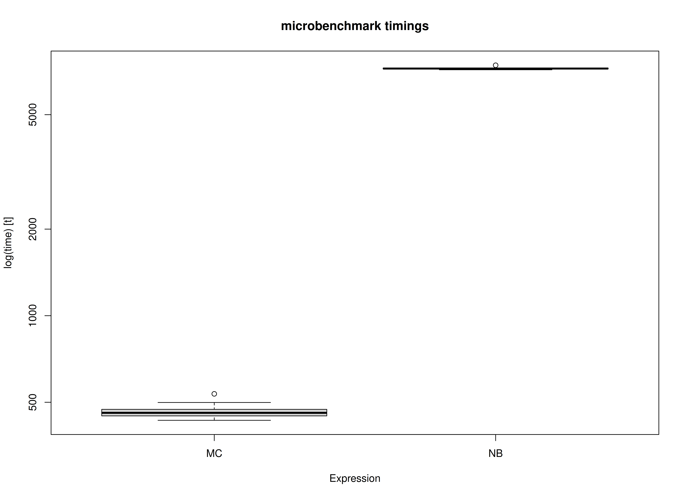

We compare the Monte Carlo (MC) method with nonparametric bootstrapping (NB)
for standardized regression coefficients.
In this example,
we use the data set and the model used in
[betaMC: Example Using the BetaMC Function](example-beta-mc.html).


``` r
library(betaMC)
library(boot)
library(microbenchmark)
```

The `BetaMC()` function is used to generate MC confidence intervals.
The `BetaNB()` function is used to generate NB confidence intervals.


``` r
BetaNB <- function(formula, data, B) {
  statistic <- function(formula, data, indices) {
    return(
      coef(lm(formula = formula, data = as.data.frame(scale(data[indices, ]))))[-1]
    )
  }
  return(boot.ci(boot(data = data, statistic = statistic, formula = formula, R = B)))
}
```

## Data and Model


``` r
df <- betaMC::nas1982
```

## Benchmark

### Arguments


|Variables |Values |Notes                               |
|:---------|:------|:-----------------------------------|
|R         |5000   |Number of Monte Carlo replications. |
|B         |5000   |Number of bootstrap samples.        |


``` r
benchmark <- microbenchmark(
  MC = {
    formula <- "QUALITY ~ NARTIC + PCTGRT + PCTSUPP"
    object <- lm(formula = formula, data = df)
    mc <- MC(object = object, R = R, type = "mvn")
    BetaMC(object = mc)
  },
  NB = {
    formula <- "QUALITY ~ NARTIC + PCTGRT + PCTSUPP"
    object <- lm(formula = formula, data = df)
    BetaNB(formula = formula, data = df, B = B)
  },
  times = 10
)
```

### Summary of Benchmark Results


``` r
summary(benchmark, unit = "ms")
#>   expr       min        lq      mean    median        uq       max neval
#> 1   MC  417.9385  432.1983  448.2969  442.9285  453.6314  505.0741    10
#> 2   NB 7109.4080 7152.7256 7179.1824 7162.1627 7191.0255 7351.3280    10
```

### Summary of Benchmark Results Relative to the Faster Method


``` r
summary(benchmark, unit = "relative")
#>   expr      min       lq     mean   median       uq      max neval
#> 1   MC  1.00000  1.00000  1.00000  1.00000  1.00000  1.00000    10
#> 2   NB 17.01066 16.54964 16.01435 16.17002 15.85213 14.55495    10
```

## Plot


